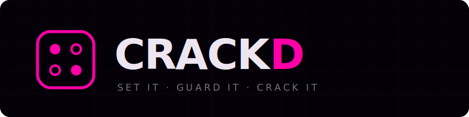

<p align="center">
  
</p>

<p align="center">
  <strong>A 1v1 code-breaking game settled on-chain. Stake XLM or USDC, outsmart the other player, take the pot.</strong>
</p>

<p align="center">
  <a href="https://stellar.expert/explorer/testnet/contract/CAFRPUU36IQQJX5O6X4XTYWQI2X7N5WXK37HUSOA256IEYDDVJGVVTHQ">Vault Contract ↗</a> ·
  <a href="https://stellar.expert/explorer/testnet/contract/CBDHNQFBASF3JZJBVA67SBDRWNCL7HPA67S5JIZ44MKLYO25H5MFFZNR">Duel Contract ↗</a> ·
  <a href="https://github.com/jamesbachini/Stellar-Game-Studio">Stellar Game Studio ↗</a>
</p>

<p align="center">
  
  
  
  
</p>

---

## What is Crackd?

Crackd is a competitive code-breaking game where each player sets a secret 4-digit code (no repeats) and takes turns guessing the opponent's. After each guess, feedback is given:

| Symbol | Meaning |
|--------|---------|
| **POT** ● | Right digit, right position |
| **PAN** ○ | Right digit, wrong position |
| **Miss** · | Digit not in the code |

First player to crack all 4 positions wins. If staked, the smart contract settles the payout instantly — no disputes, no refund forms, no middleman.

### Example Round

```
Secret:  5 8 3 1
Guess:   5 2 9 4  →  ● · · ·   (1 POT: the 5)
Guess:   5 8 1 3  →  ● ● ○ ○   (2 POT, 2 PAN)
Guess:   5 8 3 1  →  ● ● ● ●   CRACKED.
```

---

## Game Modes

| Mode | Stakes | Players | Description |
|------|--------|---------|-------------|
| **vs AI · free** | None | You vs The Vault | Warm up against the Pidgin-speaking AI. No wallet needed. |
| **vs AI · staked** | XLM or USDC | You vs The Vault | Stake to play. Win 2×–2.5× your stake from the community pool. |
| **Multiplayer · casual** | None | 1v1 humans | Invite a friend with a 6-char code. Bragging rights only. |
| **Multiplayer · staked** | XLM or USDC | 1v1 humans | Both escrow. Winner takes the pot minus 2.5% protocol fee. *(Coming soon)* |

### Reward Tiers (vs AI · staked)

Every winner gets **at least 2× their stake** back. Fast crackers earn a speed bonus:

| Guesses | Total Return | Bonus |
|---------|-------------|-------|
| 1–3 | **2.5×** | Lightning speed bonus |
| 4–5 | **2.25×** | Sharp speed bonus |
| 6+ | **2.0×** | Base win — still doubles your stake |

Pool protected by a 25% daily cap per player to prevent draining.

---

## The Vault — AI Opponent

The Vault is Crackd's AI code guardian. It speaks **West African Pidgin English**, talks trash after every guess, and plays to win.

**How it works (hybrid AI):**
1. **Algorithmic solver** narrows the 5,040-code candidate space after each guess using feedback — guarantees every AI guess is logically valid.
2. **Claude (Sonnet)** picks *which* valid candidate to guess from a filtered shortlist — strategic reasoning + personality.
3. **Pidgin taunts** generated per-event by Claude — context-aware, 1-2 sentences, never breaks character.

> *"E be like say you dey guess with your eye closed!"*
> — The Vault, after a player's bad guess

---

## Architecture

```
┌─────────────────────────────────┐
│  Frontend (Vite + React 19)     │  @creit.tech/stellar-wallets-kit
│  Tailwind + Framer Motion       │  (Freighter, Albedo, xBull, Lobstr)
└──────────────┬──────────────────┘
               │ REST + Socket.io
┌──────────────▼──────────────────┐
│  Backend (Node 20 + TypeScript) │
│  Express · Socket.io · Redis    │
│  Hybrid AI (solver + Claude)    │
└──┬───────────────────────────┬──┘
   │ @stellar/stellar-sdk      │ @anthropic-ai/sdk
┌──▼──────────┐          ┌────▼──────┐
│  Soroban    │          │  Claude   │
│  Testnet    │          │  Sonnet   │
└──┬──────────┘          └───────────┘
   │
 CrackdVault (multi-asset pool)
 CrackdDuel (PvP escrow)
 Game Hub (Stellar Game Studio)
```

### Smart Contracts (Rust / Soroban)

| Contract | Address | Purpose |
|----------|---------|---------|
| **CrackdVault** | `CAFRPUU36IQ...VTHQ` | Community prize pool. Handles stake, resolve_win, resolve_loss, daily cap, leaderboard. Multi-asset (XLM + USDC). |
| **CrackdDuel** | `CBDHNQFBAS...FZNR` | PvP escrow. Create game, join, declare winner/draw, protocol fee, timeout + expiry. Multi-asset. |
| **Game Hub** | `CB4VZAT2U3...EMYG` | Stellar Game Studio ecosystem integration. start_game / end_game reported for PvP matches. |

**Contract test coverage:** 58 tests across both contracts (30 vault + 28 duel) covering all multiplier tiers, daily caps, multi-asset independence, state-machine transitions, timeout/expiry, and edge cases.

### Backend Services

| Service | Role |
|---------|------|
| `gameLogic.ts` | Pure game rules — validate codes, compute POT/PAN, check game-over. 35 unit tests. |
| `stellarService.ts` | Soroban contract calls — simulate (reads), admin-sign (writes), player-submit (pre-signed XDR). |
| `aiService.ts` | Hybrid solver + Claude taunts. Candidate filtering + strategic LLM pick. |
| `gameHandler.ts` | Socket.io real-time game orchestration. Per-socket views (no secret leaks). |
| `gameState.ts` | Redis game sessions + invite codes + all-players leaderboard. |

---

## Running Locally

### Prerequisites

- **Node.js** 20.19+
- **Rust** 1.91+ with `wasm32v1-none` target
- **Stellar CLI** 23+
- **Redis** (via `brew install redis` or Docker)
- **Anthropic API key** (for Claude AI taunts — game still works without it via fallback taunts)

### 1. Clone & install

```bash
git clone https://github.com/martinvibes/Crackd.git
cd Crackd

# Backend
cd backend && npm install

# Frontend
cd ../frontend && npm install
```

### 2. Configure

```bash
# Backend
cp backend/.env.example backend/.env.local
# Edit backend/.env.local:
#   - ADMIN_SECRET_KEY (your Stellar testnet admin key)
#   - ANTHROPIC_API_KEY (optional, for AI taunts)

# Frontend
cp frontend/.env.example frontend/.env.local
```

### 3. Start services

```bash
# Terminal 1: Redis
brew services start redis

# Terminal 2: Backend
cd backend && npm run dev

# Terminal 3: Frontend
cd frontend && npm run dev
```

Open `http://localhost:5173` — you're live.

### 4. (Optional) Deploy contracts yourself

```bash
cd contracts
cargo build --target wasm32v1-none --release
cargo test --workspace  # 58 tests

stellar contract deploy --wasm target/wasm32v1-none/release/crackd_vault.wasm --source admin --network testnet
stellar contract deploy --wasm target/wasm32v1-none/release/crackd_duel.wasm --source admin --network testnet
```

---

## Testnet Deployment

| Resource | Address / URL |
|----------|--------------|
| Admin wallet | `GBYU6P367RQIUR63NXCNLWE2H5DIVC7BTJL6HEH7SAKSCTUIU7MH5KRY` |
| CrackdVault | [`CAFRPUU36IQQJX5O6X4XTYWQI2X7N5WXK37HUSOA256IEYDDVJGVVTHQ`](https://stellar.expert/explorer/testnet/contract/CAFRPUU36IQQJX5O6X4XTYWQI2X7N5WXK37HUSOA256IEYDDVJGVVTHQ) |
| CrackdDuel | [`CBDHNQFBASF3JZJBVA67SBDRWNCL7HPA67S5JIZ44MKLYO25H5MFFZNR`](https://stellar.expert/explorer/testnet/contract/CBDHNQFBASF3JZJBVA67SBDRWNCL7HPA67S5JIZ44MKLYO25H5MFFZNR) |
| XLM SAC | `CDLZFC3SYJYDZT7K67VZ75HPJVIEUVNIXF47ZG2FB2RMQQVU2HHGCYSC` |
| USDC SAC (Circle) | `CBIELTK6YBZJU5UP2WWQEUCYKLPU6AUNZ2BQ4WWFEIE3USCIHMXQDAMA` |
| Game Hub | `CB4VZAT2U3UC6XFK3N23SKRF2NDCMP3QHJYMCHHFMZO7MRQO6DQ2EMYG` |
| Pool seeded | 200 XLM |

---

## Project Structure

```
crackd/
├── contracts/                  # Soroban Rust smart contracts
│   ├── crackd-vault/           # Prize pool (multi-asset, vs-AI staking)
│   │   └── src/ { lib, types, storage, rewards, errors, events, test }
│   ├── crackd-duel/            # PvP escrow (multi-asset, 1v1 staking)
│   │   └── src/ { lib, types, storage, errors, events, test }
│   └── deployments/testnet.json
├── backend/                    # Node.js + TypeScript
│   └── src/
│       ├── services/           # gameLogic, stellarService, aiService, assets
│       ├── socket/             # gameHandler, chatHandler, events
│       ├── routes/             # REST: pool, leaderboard, player, game
│       ├── store/              # Redis: gameState, invite codes, all-players LB
│       └── scripts/            # smokeHub, smokeSockets
├── frontend/                   # React 19 + Vite + Tailwind + Framer Motion
│   └── src/
│       ├── pages/              # Home, Game, Leaderboard, Logos
│       ├── components/
│       │   ├── game/           # ModePicker, SetupPanel, LobbyPanel, FinishedPanel
│       │   │   └── board/      # Board, BoardHeader, GuessBubble, Composer, PlayerTile
│       │   └── Brand.tsx       # Cipher Tile logo + wordmark
│       ├── hooks/              # useGameSocket
│       ├── store/              # zustand: walletStore, gameStore
│       └── lib/                # api, socket, wallet, stellar
└── docs/
```

---

## Future Features

### 👤 Player Profiles
Dedicated `/profile` tab with editable display names, full activity history (last 50 games), win-rate graphs, and favourite-mode breakdowns. Currently players are identified by truncated wallet addresses — profiles add real identity.

### 🔐 Privy Auth (Web2 Onboarding)
Email / Google / Apple login via [Privy](https://privy.io/) embedded wallets alongside existing Freighter/Albedo/xBull. Web2 users get an auto-funded custodial Stellar wallet on first play — zero friction from landing page to first guess.

### 💱 Fiat On-Ramp (Naira / Ghana Cedis)
Partner with licensed on-ramp providers (Yellow Card, Transak) so players can buy XLM directly with NGN or GHS. Never handle fiat ourselves — redirect to the partner widget, XLM arrives in-wallet, back to Crackd. Requires legal/KYC integration.

### 🏆 Tournament Mode
8-player single-elimination brackets. All players escrow an entry fee. Winner takes the pot. Bracket state lives on-chain — no admin can rig results. Weekly tournaments with escalating prize pools.

### 🎖️ NFT Achievement Badges (Stellar NFTs)
- **Vault Breaker** — crack The Vault in 3 guesses or less
- **Unshakeable** — win 10 games in a row
- **Century Club** — play 100 games
- Minted on Stellar, tradeable, displayed on player profiles.

### 📅 Daily Challenge Mode
One code for the world, every day. Top 3 fastest solvers split a daily prize from the treasury. Drives return visits, creates global competition, and resets at midnight UTC.

### 👀 Spectator Mode
Watch live staked matches as a spectator. Separate chat room, no interference with players. Creates an esports energy around high-stakes games.

### 📱 Mobile App
React Native with push notifications for game invites, turn reminders, and tournament brackets. Biometric wallet signing.

### 🌍 Multi-Language Support
Pidgin English (current) + Yoruba, Twi, Hausa UI variants. The Vault speaks in the player's chosen language.

### 🔐 Open Escrow SDK
CrackdDuel published as an open-source SDK. Any game developer can use the same escrow pattern for their own staking games on Stellar. Positions Crackd as infrastructure, not just a game.

### 🤖 AI Difficulty Tiers
- **Easy** — random guesses from valid set (avg 8 guesses to crack)
- **Normal** — current hybrid solver (avg 5-6 guesses)
- **Hard** — minimax optimal play (guaranteed ≤5 guesses)

### 💰 Multiplayer Staked (in progress)
Both players lock equal stakes in the CrackdDuel contract. Winner takes all minus 2.5% protocol fee. Settlement is atomic — payout hits your wallet before the cheer stops.

---

## Tech Stack

| Layer | Technology |
|-------|-----------|
| Smart contracts | Rust + Soroban SDK 25.3 |
| Backend | Node.js 20, TypeScript, Express, Socket.io, Redis |
| Frontend | React 19, Vite, Tailwind, Framer Motion |
| AI | Claude Sonnet (Anthropic SDK) + deterministic solver |
| Wallet | @creit.tech/stellar-wallets-kit (Freighter, Albedo, xBull, Lobstr, Hana) |
| Blockchain | Stellar testnet (Soroban) |
| Ecosystem | Stellar Game Studio (Game Hub integration) |

---

## Team

**Martin Machiebe** ([@martinvibes](https://github.com/martinvibes)) — Cypher Labs

---

## License

MIT — see [LICENSE](LICENSE).

---

<p align="center">
  
  <br />
  <em>Built for Stellar WA Build Weekend Residency 2026 — GameFi Track</em>
</p>
